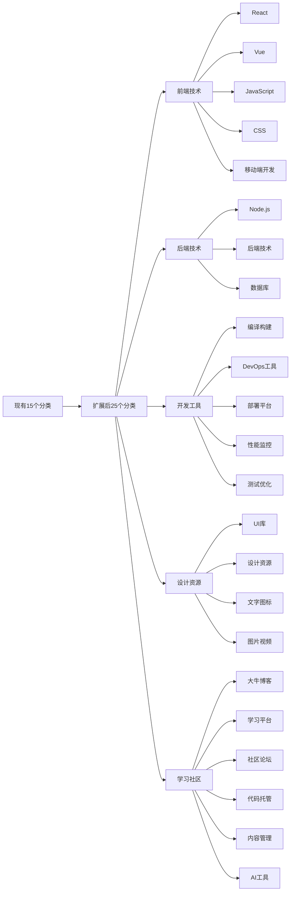
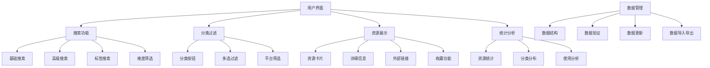
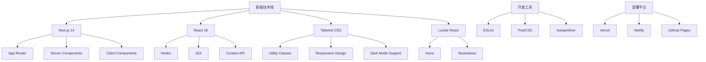
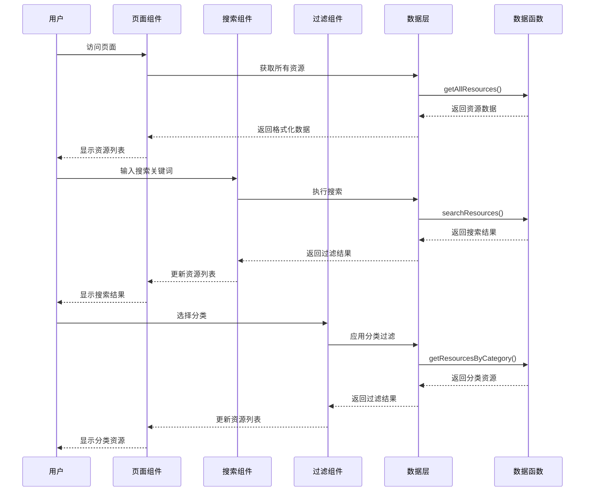
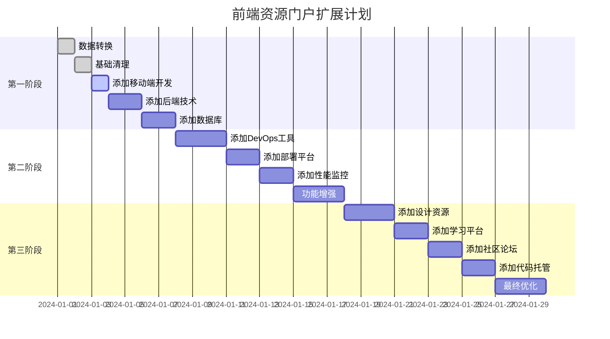
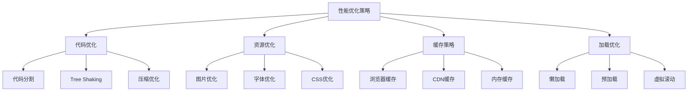

# 前端资源门户项目架构图

## 当前项目结构

```
frontend-portal/
├── .gitignore
├── package.json
├── next.config.js
├── postcss.config.js
├── tailwind.config.js
├── README.md
├── app/
│   ├── globals.css
│   ├── layout.jsx
│   └── page.jsx
├── components/
│   ├── CategoryFilter.jsx
│   ├── Header.jsx
│   ├── ResourceCard.jsx
│   └── SearchBox.jsx
└── lib/
    ├── data.js
    ├── types.js
    └── utils.js
```

## 数据架构图

```mermaid
graph TD
    A[前端资源门户] --> B[数据层]
    A --> C[组件层]
    A --> D[页面层]

    B --> E[lib/data.js]
    B --> F[lib/types.js]
    B --> G[lib/utils.js]

    E --> H[原始数据]
    E --> I[数据处理函数]
    E --> J[搜索过滤函数]

    H --> K[React]
    H --> L[Vue]
    H --> M[Node.js]
    H --> N[微信小程序]
    H --> O[UI库]
    H --> P[编译构建]
    H --> Q[框架类库]
    H --> R[JavaScript]
    H --> S[CSS]
    H --> T[可视化]
    H --> U[AI工具]
    H --> V[文字图标]
    H --> W[图片视频]
    H --> X[测试优化]
    H --> Y[大牛博客]
    H --> Z[内容管理]

    C --> AA[Header.jsx]
    C --> BB[SearchBox.jsx]
    C --> CC[CategoryFilter.jsx]
    C --> DD[ResourceCard.jsx]

    D --> EE[layout.jsx]
    D --> FF[page.jsx]

    I --> GG[generateResourceData]
    I --> HH[getAllResources]
    I --> II[getResourcesByCategory]

    J --> KK[searchResources]
    J --> LL[getCategoryStats]

    G --> MM[cn函数]
    G --> NN[formatDate]
    G --> OO[debounce]
    G --> PP[truncateText]
    G --> QQ[highlightText]
    G --> RR[getCategoryColor]
    G --> SS[getCategoryIcon]
```



## 扩展后的数据架构



## 功能架构图



## 技术栈架构



## 数据流架构



## 扩展计划时间线



## 性能优化架构



这个架构图展示了前端资源门户的完整结构，包括当前状态、扩展计划和技术实现方案。通过这个架构，您可以清晰地了解项目的各个组成部分和它们之间的关系。
